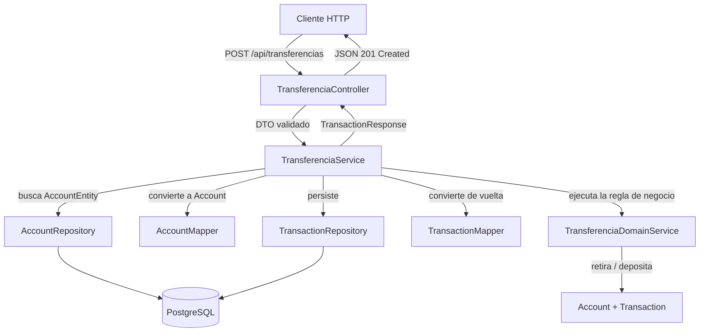

# Wallet API

Mini sistema bancario construido en Spring Boot, con foco principal en **testing profesional**: JUnit 5, Mockito, `@DataJpaTest`, MockMvc y Testcontainers, todo probado contra una arquitectura en capas real, no contra un ejemplo de juguete.

## Qué se construyó

Una API REST que administra cuentas y permite depositar, retirar y transferir dinero entre ellas, respetando reglas de negocio estrictas: nunca se puede quedar un saldo negativo, una transferencia es atómica (si falla a mitad de camino, se revierte por completo), y toda operación queda registrada como una transacción con su propio estado (`PENDIENTE`, `COMPLETADA`, `FALLIDA`).

## La idea detrás del proyecto

El objetivo no era construir un banco — era construir algo lo bastante realista como para que **el testing tuviera que tomarse en serio**. Un sistema de transferencias de dinero es el dominio perfecto para esto: tiene reglas con consecuencias reales (saldo insuficiente, atomicidad), fuerza a pensar en casos límite desde el diseño, y es lo bastante pequeño como para que el testing sea el protagonista del proyecto, no una tarea pegada al final.

Por eso el proyecto se construyó **de adentro hacia afuera**: primero el dominio, como clases de Java puras sin ninguna dependencia de Spring, probadas con JUnit 5 antes de escribir una sola línea de infraestructura. Recién después se envolvió ese dominio con persistencia, servicios de aplicación y una API REST — cada capa agregada, y probada, una a la vez.

## Diagrama de delegación y comunicación

El siguiente diagrama muestra cómo fluye una transferencia entre cuentas a través de las capas del sistema, desde que llega la petición HTTP hasta que se persiste en la base de datos.



Un detalle de diseño clave que no se ve directamente en el diagrama: `TransferenciaDomainService` no sabe que Spring, JPA ni PostgreSQL existen. Solo conoce `Account` y `Transaction`, dos clases de dominio puras. Toda la comunicación con la base de datos pasa por `TransferenciaService`, que es quien de verdad conoce ambos mundos y traduce entre ellos.

## Desglose detallado de la delegación y comunicación

### 1. Controller → Service: HTTP a lenguaje de aplicación

`TransferenciaController` no contiene ninguna lógica de negocio. Su único trabajo es traducir: recibe un `TransferenciaRequest` (JSON), validado automáticamente por Bean Validation (`@NotBlank`, `@Positive`) antes de que el método se ejecute, y delega inmediatamente a `TransferenciaService.transferir(...)`. Si algo sale mal más adelante en la cadena, el Controller nunca lo sabe explícitamente — deja que la excepción se propague hasta `GlobalExceptionHandler`, que la traduce a un código HTTP (`409` para saldo insuficiente, `400` para datos inválidos).

### 2. Service → Repository: traer el estado actual

`TransferenciaService` es el único punto del sistema que conoce las cinco piezas necesarias para completar una transferencia: los dos repositorios, los dos mappers, y el servicio de dominio. Lo primero que hace es pedirle a `AccountRepository` las dos `AccountEntity` (origen y destino) por su número de cuenta. Si alguna no existe, el flujo termina ahí — ni la lógica de negocio ni la base de datos llegan a tocarse.

### 3. Service → Mapper: cruzar la frontera entre persistencia y dominio

Con las entidades en mano, `AccountMapper` las convierte en objetos `Account` — el dominio puro. Esta es la frontera deliberada del proyecto: todo lo que está a un lado (`AccountEntity`, JPA, la base de datos) no sabe nada de reglas de negocio; todo lo que está al otro lado (`Account`, `Transaction`) no sabe nada de cómo se persiste.

### 4. Service → DomainService: la regla de negocio, aislada

`TransferenciaDomainService.transferir(origen, destino, monto)` recibe dos objetos `Account` ya en memoria. Ahí adentro: retira del origen, intenta depositar en destino, y si el depósito falla, revierte el retiro manualmente (no hay una base de datos real de por medio en esta capa, así que la atomicidad se programa a mano). Esta misma clase, sin cambiar una sola línea, se probó primero de forma completamente aislada — sin Spring, sin base de datos, sin Testcontainers — y luego otra vez como parte del flujo completo end-to-end.

### 5. Service → Mapper → Repository: volver a persistir

El resultado (dos cuentas con saldos actualizados y una `Transaction` marcada `COMPLETADA` o `FALLIDA`) se convierte de vuelta a entidades JPA y se guarda. Todo el método está anotado con `@Transactional`: si algo falla entre estos pasos, Spring revierte automáticamente todo lo que ya se había guardado en esa transacción — la misma garantía de atomicidad que el dominio programa a mano, pero ahora respaldada por la base de datos real.

### 6. Service → Controller → Cliente: el camino de vuelta

El `Service` devuelve un objeto de dominio (`Transaction`); el `Controller` lo convierte a `TransactionResponse` (el DTO de salida) y lo serializa a JSON con el código de estado correspondiente. El cliente nunca ve una entidad JPA ni un objeto de dominio directamente — solo la forma pública que el Controller decide exponer.

## Cobertura de testing por capa

| Capa | Herramienta | Qué prueba |
|---|---|---|
| Dominio (`Account`, `Transaction`, `TransferenciaDomainService`) | JUnit 5 | Reglas de negocio puras, sin Spring |
| Mappers | JUnit 5 + Mockito | Conversión dominio ↔ entidad, con dependencias mockeadas |
| Repositorios | `@DataJpaTest` | Queries reales contra PostgreSQL |
| Servicios de aplicación | Mockito | Orquestación, con las 5 dependencias mockeadas |
| Controllers | `@WebMvcTest` + MockMvc | Códigos HTTP, validación, serialización JSON |
| Flujo completo | `@SpringBootTest` + Testcontainers | Crear cuenta → depositar → transferir, contra PostgreSQL real en Docker |

**Cobertura total (JaCoCo):** 86% de instrucciones, 83% de ramas.

## Stack técnico

- Java 21, Spring Boot 4.1.1
- Spring Data JPA + PostgreSQL
- JUnit 5, Mockito, Testcontainers, JaCoCo
- Maven

## Cómo correr el proyecto

```bash
./mvnw spring-boot:run
```

Requiere una base PostgreSQL local corriendo (configuración en `application.properties`).

## Cómo correr los tests

```bash
./mvnw clean test
```

Los tests de integración usan Testcontainers, así que Docker Desktop debe estar corriendo. El reporte de cobertura se genera en `target/site/jacoco/index.html`.